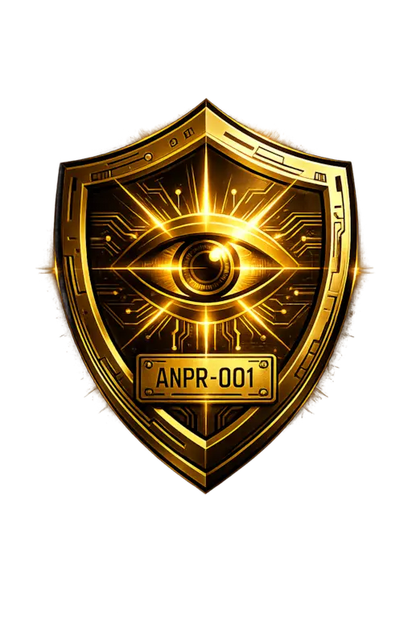

# Aegis Road Sentinel

Aegis Road Sentinel is an Automatic Number Plate Recognition (ANPR) system built for Colombian license plates. It detects vehicles and reads plate text from uploaded images, video files, and live WebSocket camera feeds using a three-stage ONNX inference pipeline, then logs every detection to PostgreSQL and validates plates against a per-user whitelist for vehicle access control.

<p align="center">
  
</p>

**Status: Active development**

---

## What the system does

A frame enters the pipeline and passes through three sequential ML models:

1. A YOLOv8 vehicle detector locates every vehicle in the frame and classifies it as car, truck, bus, or motorcycle.
2. Each vehicle crop is fed to a second YOLO model that locates the license plate within that crop.
3. The plate crop is passed to a PaddleOCR PP-OCRv4 CRNN model that extracts the plate text via CTC decoding and filters results against the Colombian plate format (`[A-Z]{3}[0-9]{2,3}[A-Z]?`).

The extracted plate is then looked up in a `allowed_cars` table. If the plate is present, the detection is marked authorized. Every detection — with vehicle type, bounding boxes, confidence scores, plate text, processing time, and access decision — is written to a `detections` audit table in PostgreSQL.

Across video frames and live streams, a custom IoU-based vehicle tracker assigns stable track IDs so each physical vehicle produces exactly one database row, updated in place whenever a higher-confidence plate reading arrives on a later frame.

---

## Architecture

```
Image / Video Frame / WebSocket JPEG
             |
             v
    [ Head 1 — YOLOv8m Vehicle Detection ]
      vehicle_yolov8m.onnx
      Output: vehicle bounding boxes + class
             |
             v
    [ Head 2 — YOLOv8 Plate Detection ]
      colombian_license_plate_model.onnx
      Input:  vehicle crop from Head 1
      Output: plate bounding box
             |
             v
    [ Head 3 — PaddleOCR PP-OCRv4 CRNN ]
      plate_ocr.onnx
      Input:  plate crop [1, 3, 48, 320]
      Output: plate text + OCR confidence
             |
             v
    [ PostgreSQL ]
      Whitelist lookup  →  authorized / not authorized
      Detection persisted to audit log
             |
             v
    [ FastAPI REST / SSE / WebSocket ]
      Results returned to client
```

All ONNX inference runs on CPU via ONNX Runtime. GPU acceleration is not enabled in the current build due to a known tensor shape conflict between onnxruntime-gpu and PaddleOCR.

---

## Technology Stack

**Backend**
- Python 3.11, FastAPI, Uvicorn
- ONNX Runtime, OpenCV, NumPy
- SQLAlchemy 2.0, Alembic, PostgreSQL 15
- passlib (bcrypt), python-jose (JWT)
- Docker, Docker Compose

**ML Models**
- YOLOv8m — vehicle detection (Roboflow-trained, 6 classes bridged to 4 canonical types)
- YOLOv8 Nano — Colombian plate localization
- PaddleOCR PP-OCRv4 — CRNN-based plate OCR

**Frontend**
- React 18, TypeScript, Vite 6, Tailwind CSS 3
- Cyberpunk HUD design system (gold/amber on near-black, Orbitron + JetBrains Mono)

---

## API Surface

All endpoints are under `http://localhost:8000`. Interactive docs at `/docs`.

| Method | Path | Auth | Description |
|---|---|---|---|
| GET | `/api/health` | No | DB ping + ANPR model state. Returns `healthy` or `degraded`. |
| POST | `/api/auth/register` | No | Create account (JSON body). |
| POST | `/api/auth/login` | No | OAuth2 form → JWT bearer token. Accepts username or email. |
| POST | `/api/anpr/detect` | JWT | Upload image → run pipeline → persist → return detections. |
| POST | `/api/stream/upload-video` | JWT | Upload video → ANPR every N frames → stream results as SSE. |
| WS | `/api/stream/ws?token=<jwt>` | JWT (query) | Send raw JPEG bytes per frame; receive JSON detections. Live feed. |
| GET | `/api/vehicles/detections` | No | Paginated detection history. Filterable by plate and access status. |
| GET/POST/DELETE | `/api/vehicles/whitelist` | JWT | Manage the authorized plates whitelist for the current user. |
| GET | `/api/stats` | No | Aggregate totals, confidence averages, access counts. Supports `from_date` / `to_date` filters. |
| GET/PATCH/DELETE | `/api/users/me` | JWT | Read or update own profile (full name, address, country, phone, password). |

---

## Vehicle Tracking

The video upload and WebSocket endpoints both use an IoU-based greedy tracker (`VehicleTracker`) that assigns stable `track_id` values across frames. The persistence strategy enforces:

- One `Detection` row is inserted when a vehicle is first confirmed (new track).
- The same row is updated — not duplicated — when a later frame produces a higher-confidence plate reading.
- All other frames for the same vehicle produce no database write.

This prevents a three-car video from producing 60+ rows and ensures the stored plate text is the highest-confidence reading seen across the entire clip.

---

## Data Model

```
User  1──N  AllowedCar      (whitelist, keyed by license_plate)
User  1──N  Detection       (audit log, FK to User and AllowedCar)
```

The `Detection` table stores: vehicle type, vehicle confidence, plate text (max 10 chars), plate confidence, plate bounding box, original image S3 key (placeholder — S3 upload not yet implemented), access decision, processing time in milliseconds, and source (`upload` / `video` / `websocket`).

---

## Running the Project

Requires Docker and Docker Compose.

```bash
# Copy and configure environment variables
cp backend/.env.example backend/.env

# First run (builds the image)
docker compose up --build

# Subsequent runs
docker compose up -d

# Run database migrations
docker compose exec api alembic upgrade head

# API:   http://localhost:8000
# Docs:  http://localhost:8000/docs
# DB:    localhost:5432
```

### Authenticating in Swagger

1. POST to `/api/auth/login` with your username and password to obtain a JWT.
2. In `/docs`, click **Authorize** and paste the token into the **BearerAuth** field.
3. All protected endpoints will send the token automatically for the session.

---

## Project Structure

```
backend/
  app/
    core/          Settings, DB session, logging
    models/        SQLAlchemy ORM: users, detections, allowed_cars, cars
    schemas/       Pydantic v2 request/response schemas
    routers/       FastAPI routers: auth, users, anpr, vehicles, stream, stats, health
    services/
      pipelines/   ANPRService, VehicleDetectionPipeline, PlateOCRProcessor
      ml_models/   ONNX model files (not in version control)
      tracking_service.py   IoU-based multi-object tracker
      user_crud_service.py  User CRUD with bcrypt password handling
    crud/
      detection_crud.py     Persist and update detections, whitelist lookup
  scripts/         Standalone ONNX experimentation scripts
  alembic/         Migration history
  Dockerfile
  requirements.txt

frontend/
  src/
    components/    Dashboard, monitor, analytics, common UI primitives
    pages/         Route-level page components
    types/         Domain types and formatters
    mocks/         Mock data for UI development (seeded with real CAJ814 detection)
  tailwind.config.js
  vite.config.js
```

---

## Validated Performance

Tested end-to-end on a real Colombian plate (CAJ814) on CPU:

- Vehicle detection confidence: 0.677
- Plate detection confidence: 0.945
- OCR confidence: 0.825
- Total pipeline latency: approximately 334 ms per frame

---

## Remaining Work

- S3 image upload (boto3 wired, columns exist, upload logic not implemented)
- Test suite (pytest installed, no tests written)
- Role-based access control (admin flag on User, guards on user management endpoints)
- Frontend API integration (services and Zustand stores are empty stubs; dashboard runs on mock data)

---

## License

MIT License. See LICENSE for details.

---

## Acknowledgements

Built on open-source foundations: Ultralytics YOLO, PaddleOCR, FastAPI, OpenCV, ONNX Runtime, PostgreSQL, SQLAlchemy, React, and Docker.
